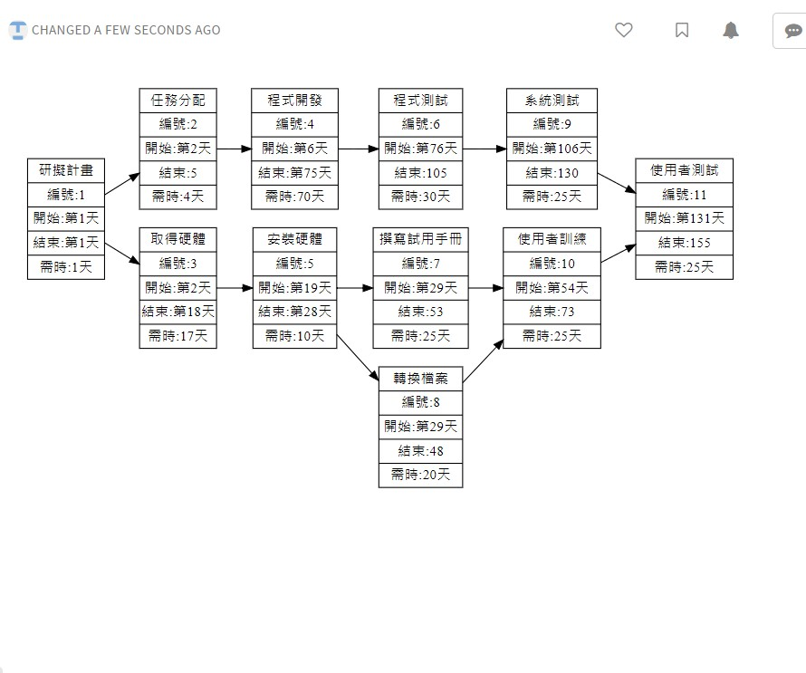
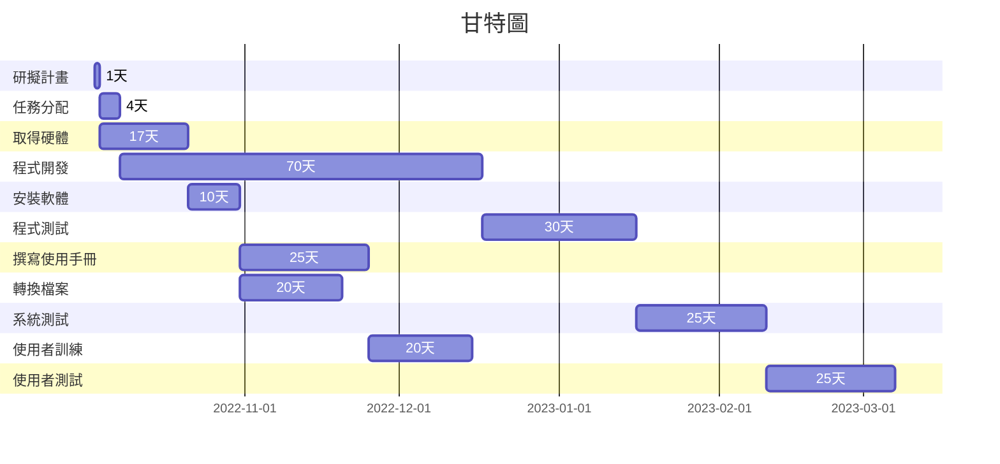

# PERT/CPM

***


# 甘特圖

# 關鍵路徑
---

***
```graphviz
digraph {
	node[shape=record];
	rankdir="LR";
    no1 [label = "取得授權 | 編號:1 | 開始:第1天 | 結束:第1天 | 需時:1天"]
    no2 [label = "聘僱分析師 | 編號:2 | 開始:第2天 | 結束:5 | 需時:4天"]
    no3 [label = "規劃訓練 | 編號:3 | 開始:第2天 | 結束:第18天 | 需時:17天"]
    no4 [label = "安排後勤 | 編號:4 | 開始:第6天 | 結束:第75天 | 需時:70天"]
    no5 [label = "宣告訓練 | 編號:5 | 開始:第19天 | 結束:第28天 | 需時:10天"]
    no6 [label = "聘僱分析師 | 編號:6 | 開始:第76天 | 結束:105 | 需時:30天"]
    no7 [label = "聘僱分析師 | 編號:7 | 開始:第29天 | 結束:53 | 需時:25天"]
    no8 [label = "聘僱分析師 | 編號:8 | 開始:第29天 | 結束:48 | 需時:20天"]
    no9 [label = "聘僱分析師 | 編號:9 | 開始:第106天 | 結束:130 | 需時:25天"]
    no10 [label = "聘僱分析師 | 編號:10 | 開始:第54天 | 結束:73 | 需時:25天"]
    no11 [label = "聘僱分析師 | 編號:11 | 開始:第131天 | 結束:155 | 需時:25天"]
    no1->no2
    no1->no3
    no2->no4
    no3->no5
    no4->no6
    no6->no9
    no9->no11
    no5->no7
    no5->no8
    no7->no10
    no8->no10
    no10->no11
    
}


